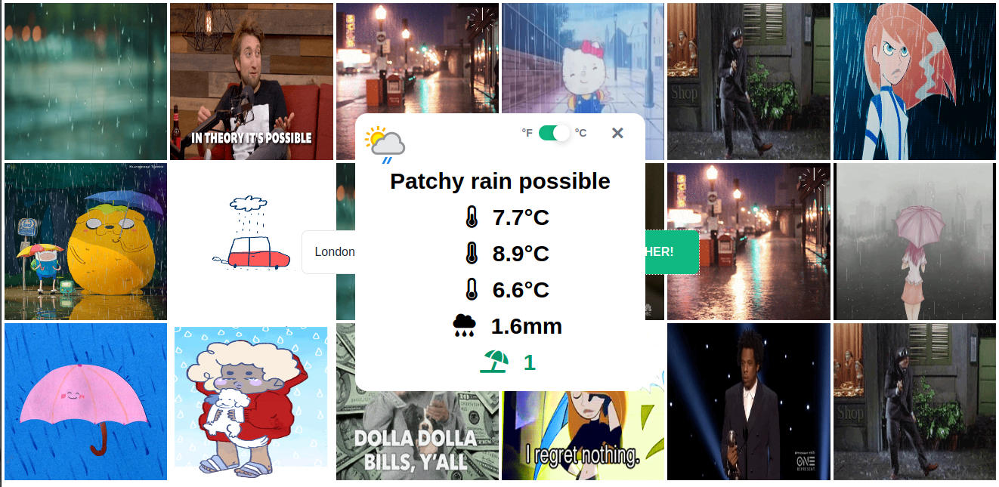

# Weather by Gifs

> This project is aimed to learn and practicing fetching data from APIs rendering a simple webpage that shows the weather of a city provided by the input of the user.

Additional description about the project and its features.

## Built With

- HTML,
- CSS,
- Tailwind,
- Webpack,
- Javascript.

## Live Demo

[Live Demo Link](https://wrakc.github.io/weather-by-gifs/)

## Setup

 - Open a terminal
 - Copy this code : 
 
        git clone https://github.com/wrakc/weather-by-gifs.git

- If you want to change anything, start your terminal and run the following commands to make sure everything is installed:
  
        npm install
       
        npm run build
  
- Open index.html that is inside the dist folder to check the result. 
  

  
## Author

👤 **Carlos Veiga**

- Github: [@githubhandle](https://github.com/wrakc)
- Twitter: [@twitterhandle](https://twitter.com/carlosveig)
- Linkedin: [linkedin](https://linkedin.com/chveiga)

## 🤝 Contributing

Contributions, issues and feature requests are welcome!

Feel free to check the [issues page](issues/).

## Show your support

Give a ⭐️ if you like this project!

## Acknowledgments

- Thanks the minskins,
- and Microverse for the opportunity.

## 📝 License

This project is [MIT](lic.url) licensed.
